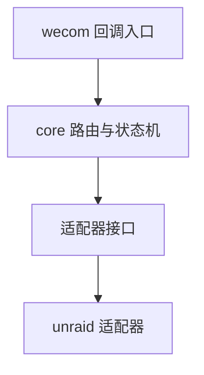

# 技术设计: 企业微信对接 Unraid 容器管理（MVP）

## 技术方案

### 核心技术
- Go（`net/http`）
- 企业微信回调加解密与验签（优先使用轻量第三方库或自实现，避免引入全量 SDK）
- 结构化日志（用于审计）
- 适配器层接口（便于后续扩展 PVE/Qinglong 等）
  - Unraid API 参考: https://github.com/s3ppo/unraid_mobile_ui（GraphQL `/graphql` + `x-api-key`）

### 实现要点
- **入口统一:** 单一 HTTP 服务暴露 `/wecom/callback`，负责回调校验与消息分发
- **状态机:** 以 `wecom_userid` 作为会话主键，记录 pending_action 与 TTL，支撑参数输入与取消/超时
- **危险操作:** 停止/强制更新视为危险操作，默认二次确认（可配置）
- **Unraid 连接器可替换:** MVP 使用 Unraid Connect 插件 GraphQL API；对外抽象客户端接口，便于后续兼容不同版本/插件能力差异

## 架构设计

## 架构决策 ADR

### ADR-001: 单体服务 + 适配器插件化
**上下文:** 需要快速落地 MVP，同时为后续 PVE/Qinglong 扩展保留结构空间。  
**决策:** 采用单体服务承载 wecom/core，业务通过适配器接口扩展不同后端服务。  
**理由:** 部署简单；边界清晰；扩展成本可控。  
**替代方案:** 核心服务 + 各服务 Agent → 拒绝原因: 增加部署与通信复杂度，不符合 MVP。  
**影响:** 需要定义稳定的适配器接口，并在 core 中保持对具体服务最小依赖。

### ADR-002: MVP 默认“内存会话状态 + 日志审计”
**上下文:** 个人使用，优先降低依赖与部署成本。  
**决策:** 会话状态保存在内存并带 TTL；审计先以结构化日志落地。  
**替代方案:** SQLite 持久化 → 拒绝原因: 提升复杂度；可在后续迭代引入。  
**影响:** 服务重启会丢失未完成会话；需清晰提示用户重新发起操作。

## API设计

### [GET/POST] /wecom/callback
- **请求:** 企业微信回调（GET 校验 `echostr`；POST 为 XML 加密消息）
- **响应:** 成功时返回企业微信要求的格式；业务回复通过“发送消息 API”异步下发

### [GET] /healthz
- **响应:** 200 OK

## 数据模型
- Config：企业微信参数（CorpID/AgentID/Secret/Token/EncodingAESKey），Unraid 连接参数，用户白名单
- Conversation State：`wecom_userid` → `pending_action/pending_target/expires_at`

## 安全与性能
- **安全:**
  - 回调验签 + 解密失败直接拒绝
  - 用户白名单（MVP）
  - 输入校验（容器名白名单字符集、长度限制）
  - 敏感信息脱敏与禁止写入日志
- **性能:**
  - access_token 缓存（带过期刷新）
  - 外部调用（Unraid）设置超时与并发限制

## 测试与部署
- **测试:** 单元测试覆盖验签/加解密、状态机流转、Unraid 执行器抽象
- **部署:** Docker 优先；要求回调地址可被企业微信访问且为 HTTPS（可通过反代/内网穿透）

---

## Unraid API 说明（MVP）

### 连接方式
- **协议:** HTTP(S)
- **端点:** `http(s)://<unraid-host>:<port>/graphql`
- **认证:** Header `x-api-key: <token>`（token 可通过 `unraid-api apikey --create` 创建，具体以 Unraid 环境为准）

### GraphQL 能力使用策略
- **容器列表:** 通过查询获取容器 `id` 与 `names/state/status`
- **停止/启动:** 通过 docker stop/start mutation
- **重启:** stop + start（并对“容器已停止/已启动”做幂等处理）
- **强制更新:** 启动时通过 introspection 探测是否存在 docker update/pull/recreate 相关 mutation；若存在则使用；否则返回“当前 Unraid API 版本不支持强制更新”的可诊断提示（后续可扩展其他实现路径）
