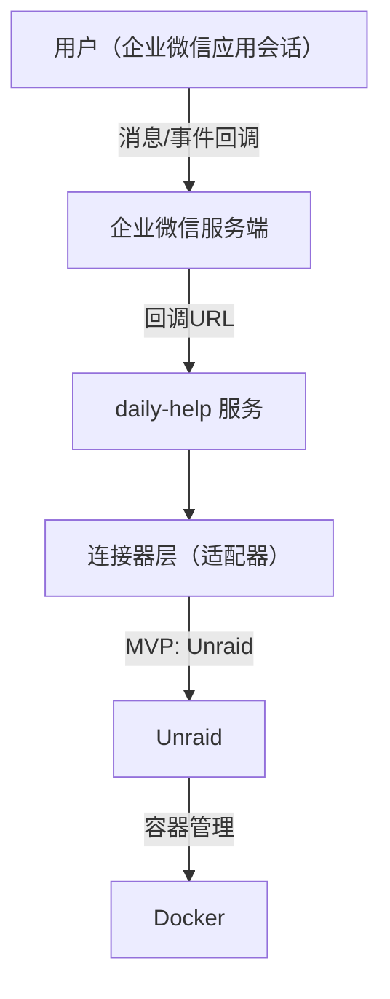
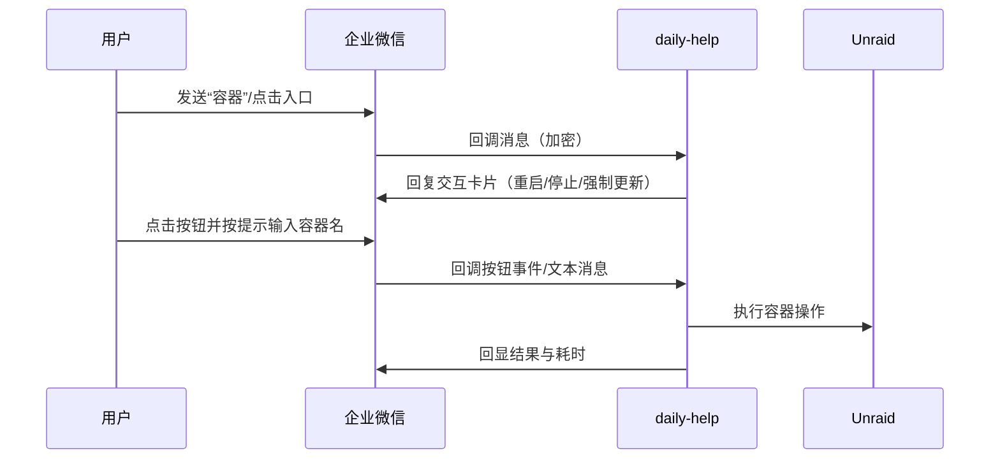

# 架构设计

## 总体架构

## 技术栈
- **后端:** Go（`net/http`）
- **数据:** MVP 默认内存会话状态 + 文件日志（可选扩展 SQLite）
- **部署:** 本地服务器/NAS/Docker（需公网 HTTPS 或可被企业微信访问的回调地址）
 - **Unraid:** Unraid Connect 插件 GraphQL API（`/graphql` + `x-api-key`）

## 核心流程

## 重大架构决策
完整的 ADR 存储在各变更的 how.md 中，本章节提供索引。

| adr_id | title | date | status | affected_modules | details |
|--------|-------|------|--------|------------------|---------|
| ADR-001 | 单体服务 + 适配器插件化 | 2026-01-12 | ✅已采纳 | core,wecom,unraid | [how.md](../history/2026-01/202601120816_wecom_unraid/how.md) |
| ADR-002 | MVP 默认“内存会话状态 + 日志审计” | 2026-01-12 | ✅已采纳 | core | [how.md](../history/2026-01/202601120816_wecom_unraid/how.md) |
